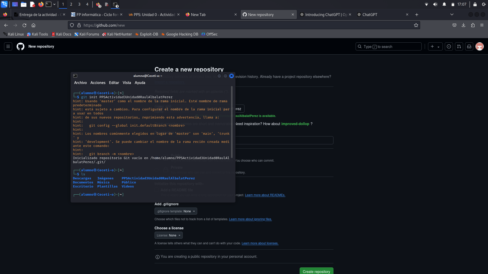
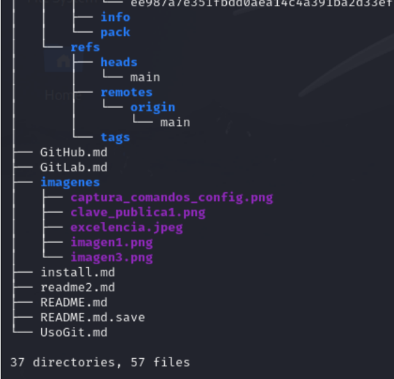
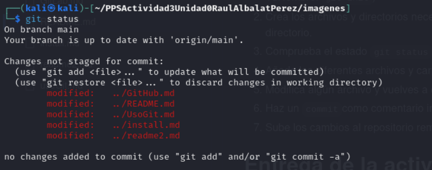
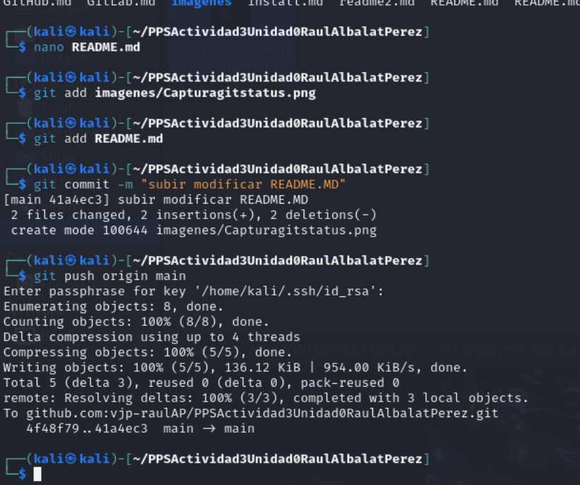
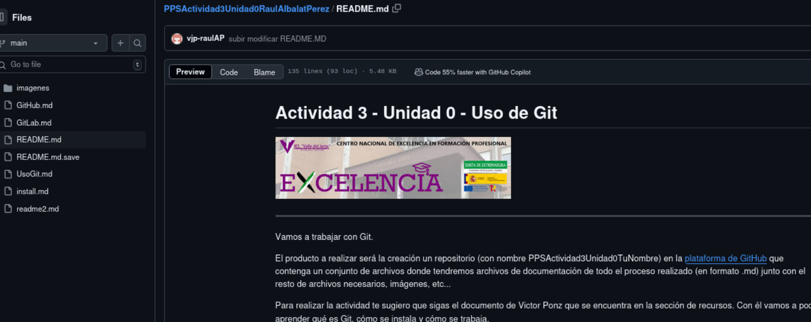

Actividad 3 - Unidad 0 -
Uso de Git
===============

---
Vamos a trabajar con Git.

El producto a realizar será la creación un repositorio (con nombre PPSActividad3Unidad0TuNombre) en la [plataforma de GitHub](https://github.com/)  que contenga un conjunto de archivos donde tendremos archivos de documentación de todo el proceso realizado (en formato .md) junto con el resto de archivos necesarios, imágenes, etc...

Para realizar la actividad te sugiero que sigas el documento de Victor Ponz que se encuentra en la sección de recursos. Con él vamos a poder aprender qué es Git, cómo se instala y cómo se trabaja. 

# INDICE

[Pasos a Realizar](#pasos-a-seguir)

[Contenidos del repositorio](#Contenidos-del-repositorio)

[Primeros Pasos](#Primeros-pasos)

[Uso de git](uso.md)

[Creación de Contenedor GitLab](#Creación-de-Contenedor-GitLab)

# Pasos a seguir

Los pasos a realizar son los siguientes

1. Abre una cuenta en Github.com con tu cuenta de @informatica.iesvalledeljerteplasencia.es.
+ La cuenta ya la tengo abierta ya que la usamos en primero de ASIR. el correo elctronico es **ralbalatp01@informatica.iesvalledeljerteplasencia.es** y el usuario **vjp-raulAP**
+ Accedo con mis credenciales y contraseñas y podemos ver esto:

2. Instala git y php en tu equipo.
  + Para instalar **git** haremos:
 
~~~
     /// sudo apt update 
     /// sudo apt install git
     *verificamos la instalacion de git
     /// git --version
~~~        
+ Para instalar **php**:
~~~ 
     /// sudo apt install php
     *verificamos la instalacion de php
     /// php --version
~~~     

3. Configura tu cuenta y git correctamente.
+ Para configurar el nombre y correo para asociar los commit correctamente hacemos:
~~~ 
     git config --global user.name "Raul Albalat Perez"
     git config --gloval user.email "ralbalatp01@informatica.iesvalledeljerteplasencia.es"
~~~ 

> - Recuerda que tienes que crear una clave y añadirla en git [puedes consultar 
éste artículo](https://juncotic.com/repositorios-git-ssh/) 
  + Creacion de clave **SSH** y agregarla a **Github**
    - Lo que tenemos que hacer es generar una clave SSH para autenticarnos sin necesidad de contraseñas. con el comando.
      ~~~ 
       /// ssh-keygen -t rsa -b -C ralbalatp01@informatica.iesvalledeljerteplasencia.es
      ~~~     
    - Despues tenemos que agregar la clave pública a mi cuenta de Github copiando la clavecon el comando.
      ~~~ 
       /// cat ~/.ssh/id_rsa.pub
      ~~~     
    - Copiamos el contenido y dentro de Github en Settings > SSH and GPG keys pegamos nuestra clave
    
>### Contenidos del repositorio
 
 El repositorio contiene los siguientes archivos y carpetas:

+ Carpeta "Images" con las imágenes y capturas que aparecen el los ficheros.md
+ README.md donde se incluirá una introducción.
  - Tendrá enlaces al resto de los archivos .md del repositorio.
+ Install.md donde se explicará el proceso de instalación y configuración de Git en nuestro equipo local.
  - Habrá dos secciones:Instalación y configuración. Habrá enlaces interno para ir a cada una de las secciones.
  - Aquí deberás de incluir ``fragmentos de código`` en vez de captura de pantalla. Bien incrustados o 
~~~
     /// codigo en 
     /// varias líneas
~~~

+ UsoGit.md donde indicaremos los comandos principales que usamos en Git.
+ GitHub.md donde explicaremos el proceso de apertura de cuenta, login y funcionamiento básico de la plataforma github.com (deberemos de crear cuenta o utilizar una asociada al correo del centro).
+ GitLab.md donde explicaremos el proceso para levantar un contenedor docker en nuestra máquina con una instancia de GitLab.

> ### Primeros pasos

1. Crea un nuevo repositorio en gitHub y lo clonas en tu equipo. El repositorio debe de llevar por nombre PPS-Unidad0Actividad3-TuNombre. ``git init``)
 Creo un repositorio con el nombre PPS-Unidad0Actividad3-RaulAlbalatPerez con git init

2. Crea los archivos y directorios necesarios y los añades al proyecto.Haz un listado en forma de arbol (tree -a) de todos los archivos del directorio.
 Dentro del repositorio creado. Creamos una carpeta donde "imagenes" donde guardaremos todas las imagenes con el comando MKDIR 
 

3. Comprueba el estado ``git status``

5. Añade los diferentes archivos y carpetas ``git add ``o ``git add -A``
+ Al modificar cualquier archivo creado, tenemos que hacer **git add** del archivo que modifiquemos. Seguidamente hacemos un **git commit -m** y para subirlo a GitHub los cambios **git push origin main**.

7. Modifica algún archivo y vuelves a comprobar su estado.

9. Haz un ``commit``como comentario indica que es la creación de archivos y vuelves a comprobar su estado
+ Para hacer un commit lo que hacemoses el comando **git commit -m "Ponemos comentario del cambiorealizado"**

11. Sube los cambios al repositorio remoto ``git push origin main` y comprueba si todo se visualiza correctamente.

# Entrega de la actividad
En esta entrega deberas de haber modificado los archivos:
1. README.md
2. install.md con el proceso de instalación y configuración de git en nuestro equipo.
3. GitHub.md con creación de cuenta y uso básico de Git (creación de repositorio, claves SSH, ...)
4. UsoGit.md con los comandos que has usado hasta el momento.
 
 Por el momento con esto es suficiente, ya completaremos más más adelante.

## Creación-de-Contenedor-GitLab

Esta actividad se relaciona con el resultado de aprendizaje RA5b
